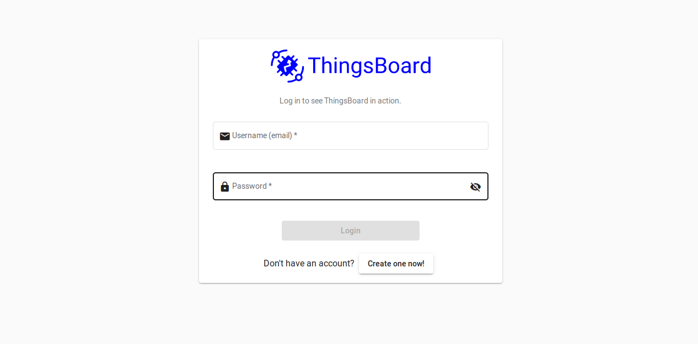

# NgThingsboard

Thingsboard UI built with latest Angular 8.

## Prerequisites

- Install Node.js (and npm)
- Clone the project
- cd into project directory
- `npm install` to install dependencies
- Then run:
  - `ng serve` for a dev server.
  > Navigate to `http://localhost:4200/`. The app will automatically reload if you change any of the source files.

  - `ng build` to build the project.
  > The build artifacts will be stored in the `dist/` directory. Use the `--prod` flag for a production build.
